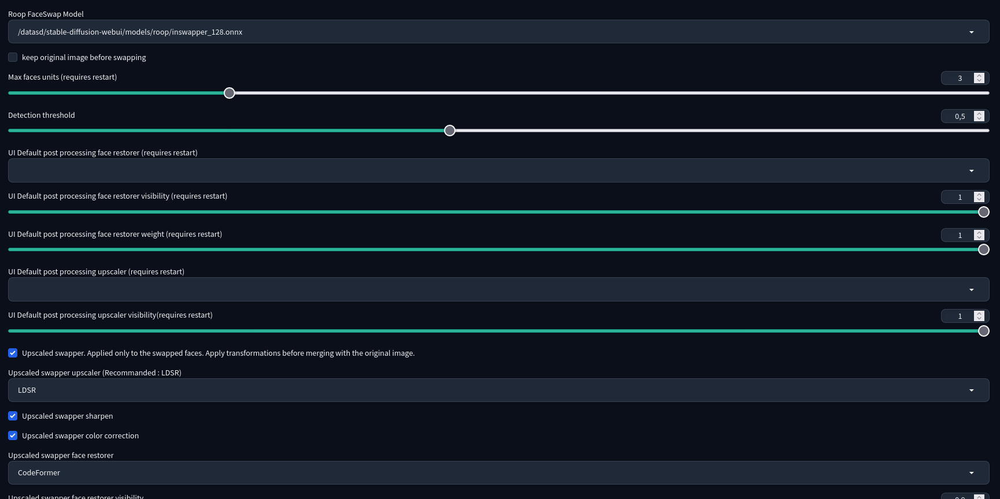
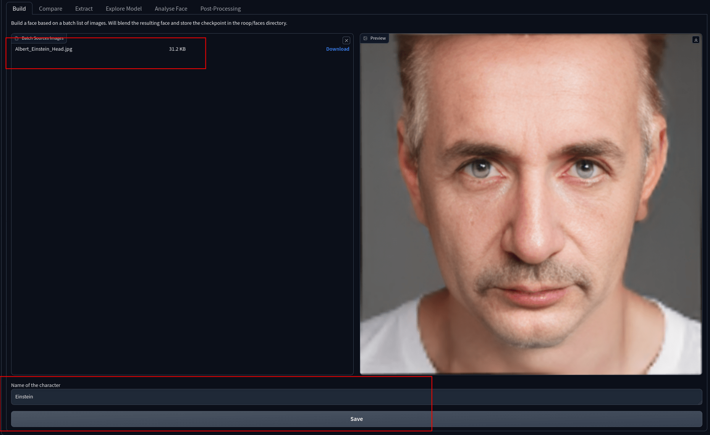
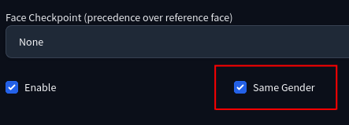
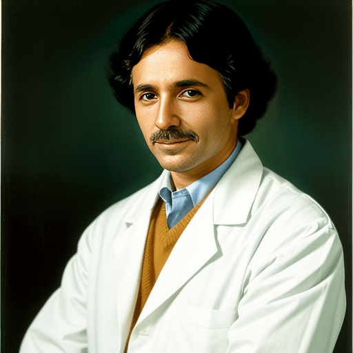
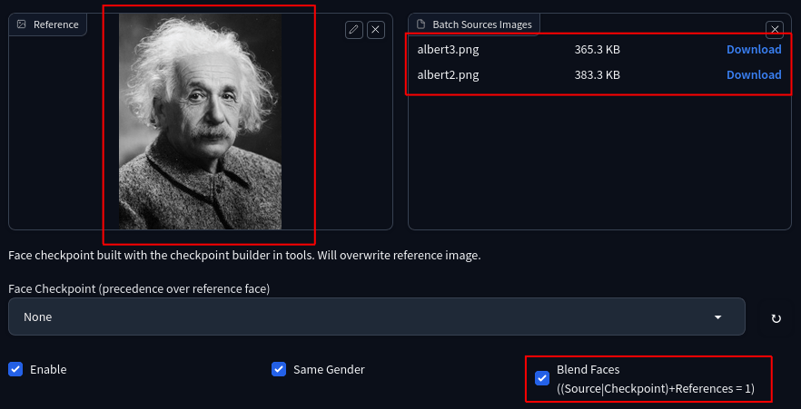
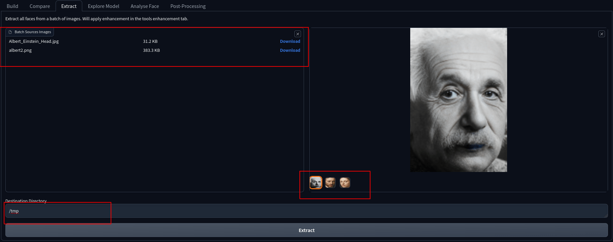
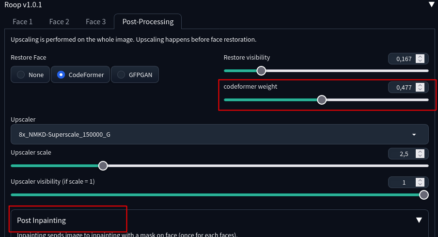
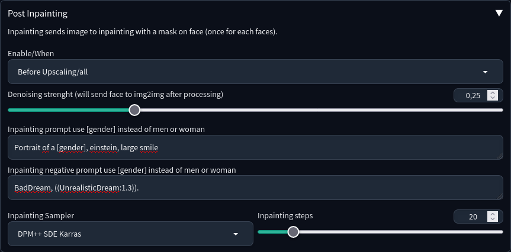
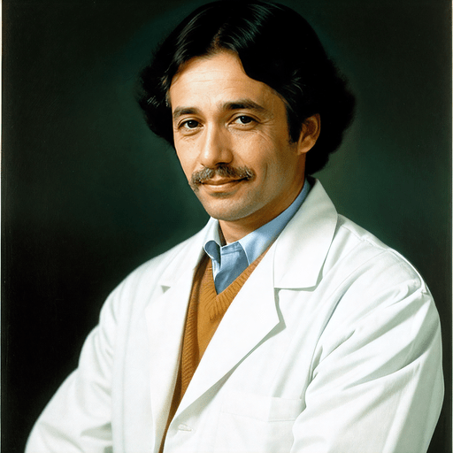

# Roop 1.0 for StableDiffusion

This is an extension for StableDiffusion's [AUTOMATIC1111 web-ui](https://github.com/AUTOMATIC1111/stable-diffusion-webui/) that allows face-replacement in images. It is based on [roop](https://github.com/s0md3v/roop) but will be developed seperately.

Main interface :

### Disclaimer

This software is meant to be a productive contribution to the rapidly growing AI-generated media industry. It will help artists with tasks such as animating a custom character or using the character as a model for clothing etc.

The developers of this software are aware of its possible unethical applicaitons and are committed to take preventative measures against them. It has a built-in check which prevents the program from working on inappropriate media. We will continue to develop this project in the positive direction while adhering to law and ethics. This project may be shut down or include watermarks on the output if requested by law.

Users of this software are expected to use this software responsibly while abiding the local law. If face of a real person is being used, users are suggested to get consent from the concerned person and clearly mention that it is a deepfake when posting content online. Developers of this software will not be responsible for actions of end-users.

**This extension should not be forked to provide a public easy way to circumvent NSFW filtering.**

### Features

+ Notion of face unit as for controlNet: The program introduces the concept of a face unit, similar to controlNet. Currently, there are three default units available (configurable option in sd, supports up to 10 units). To work with face units, configure the desired number of units in the program settings (sd).

+ Support of Vladmantic and a1111. 

+ Fixed inpainting "only masked" and mask

+ Performance improvements

+ Roop Tab with tools. A new Roop Tab has been added, providing various tools. To access the Roop Tab and its tools, navigate to the corresponding section in the program interface.

+ Roop settings in sd settings : Roop settings have been integrated into the sd settings. To configure Roop settings, navigate to the sd settings section of the program interface.

+ Allow reuse of faces via checkpoints (~2kb): Checkpoints can now be built in the FaceTools tab, enabling the reuse of faces. Checkpoints take precedence over the reference image, with the reference source image being discarded while retaining the batch source images. To build checkpoints for face reuse, follow the steps outlined in the FaceTools tab.

In builder :

In face swapper :

+ Gender detection of faces : The program now includes gender detection for faces. Note that face numbers only represent gender and can be disabled if desired. To enable or disable gender detection, refer to the corresponding settings in the program interface.

+ Face combination (blending) sources, references, and checkpoints: Blending (face combination) is now activated by default. This feature allows the use of multiple versions of a face to improve the swapping result. Face blending is also performed during the creation of face checkpoints using the batch source image option. To utilize face combination and blending, refer to the options available in the program interface, particularly in the batch source image section.

Configuration : 

Result :

+ Keep original images before swap (option): This option allows the preservation of the original images before the swapping process. To enable or disable the preservation of original images, refer to the corresponding option in the settings interface.

+ Several versions of the same face can be used for replacement: Multiple versions of the same face can now be used for replacement. If blending is not activated, several images will be generated. Otherwise, blended faces will be created. This feature utilizes the batch source image option. To use multiple versions of a face for replacement, follow the instructions in the batch source image section.

+ Face similarity and filtering: Face similarity and filtering have been introduced, allowing comparisons against the reference and/or source images. This feature can be configured using the two sliders: minimum similarity (min sim) and minimum reference similarity (min ref sim). The reference can be either the checkpoint or the reference image.Adjust the sliders (min sim and min ref sim) to configure face similarity and filtering according to your requirements.

+ Face comparison in tools: The extension now includes face comparison functionality in the tools section. To perform face comparison, navigate to the tools section and follow the instructions provided.

+ Face extraction in tools: Face extraction, with or without upscaling, is now available in the tools section. To extract faces, with or without upscaling, refer to the corresponding options in the tools section.

+ Better post-processing with a lot of options :

+ Post inpainting: This feature allows the application of image-to-image inpainting specifically to faces. To apply post inpainting to faces, follow the instructions provided in the program interface.

Configuration :

Result :

    LDSR upscaled inswapper:
        Description: The program includes an LDSR upscaled inswapper option, which may help improve results. It incorporates LDSR (Laplace-Dirichlet) upsampling, sharpness adjustment, and color correction.
        Instructions: To enable the LDSR upscaled inswapper option, refer to the sd settings section.

    API example (not retested):
        Description: The program includes an API example. Note that this example has not been retested.
        Instructions: Consult the provided API documentation for information on utilizing the API example.

## Installation
First of all, if you can't install it for some reason, don't open an issue here. Google your errors.

> On Windows, download and install [Visual Studio](https://visualstudio.microsoft.com/downloads/). During the install, make sure to include the Python and C++ packages.

+ Run this command: `pip install insightface==0.7.3`
+ In web-ui, go to the "Extensions" tab and use this URL `https://github.com/s0md3v/sd-webui-roop` in the "install from URL" tab.
+ Close webui and run it again
+ If you encounter `'NoneType' object has no attribute 'get'` error, download the [inswapper_128.onnx](https://huggingface.co/henryruhs/roop/resolve/main/inswapper_128.onnx) model and put it inside `<webui_dir>/models/roop/` directory.

For rest of the errors, use google. Good luck.

## Usage

1. Under "roop" drop-down menu, import an image containing a face.
2. Turn on the "Enable" checkbox
3. That's it, now the generated result will have the face you selected

## Tips

#### I hate you for filtering NSFW

I totally get why people wants it as an option. But it would make it too easy to bypass. I am not against nsfw in general on sd. I am against swapping the face of a real person into nsfw content which is really different. If it were possible to check that the faces were synthetic faces (which is currently not reliably possible) before making the swap, I would have no problem with this. Making it easy for everyone seems ethically risky. In any case, I wouldn't take this responsibility on a personal level. I wouldn't want to feel responsible for someone being harassed with this tool.

#### Getting good quality results
First of all, make sure the "Restore Face" option is enabled. You can also try the "Upscaler" option or for more finer control, use an upscaler from the "Extras" tab.

For even better quality, use img2img with denoise set to `0.1` and gradually increase it until you get a balance of quality and resembelance.

#### Replacing specific faces
If there are multiple faces in an image, select the face numbers you wish to swap using the "Comma separated face number(s)" option.

#### The face didn't get swapped?
Did you click "Enable"?

If you did and your console doesn't show any errors, it means roop detected that your image is either NSFW or wasn't able to detect a face at all.

### FAQ

The issues are full of requests that sometimes stem from a misunderstanding of the tool. We don't have the time to respond to all these requests. This FAQ contains some frequently asked questions. Please read this before submitting an issue.

#### I don't see any extension after restart

This is likely because you're using Windows and haven't installed the requirements. Check that there are no errors in the terminal and check the installation section.

If you have a specific configuration (python 3.11, ...), test it with a clean installation of stable diffusion before submitting an issue.

#### Why i don't get good quality results

The model used first reduces the resolution of the face to be modified before generating a 128x128 image. This means that whatever the size of the original image, the faces won't have a resolution higher than 128x128, which is very low.

The process therefore gives very average results, which can be mitigated with the use of face restorer and upscaler.

There's no way to improve this, and there's no point in asking for it. Roop is an interface for the model. Unless you can re-train a model for insighface and make the necessary changes in the library (see below), the results will remain average.

Don't be too demanding about results. Think of the extension as a low-cost alternative to lora, or as a complement to it.

#### Same gender does not detect correct gender

This information is provided by the analysis model. It is therefore potentially wrong. Nothing can be done to improve it on our side.

#### Why GPU is not supported ?

Adding support for the GPU is easy in itself. Simply change the onnxruntime implementation and change the providers in the swapper. You can try this with roop.

If it's so easy, why not make it an option? Because sd models already take a lot of vram, and adding the model to the GPU doesn't bring any significant performance gains as it is. It's especially useful if you decide to handle a lot of frames and video. Experience shows that this is more trouble than it's worth. That's why it's pointless to ask for this feature.

To convince yourself, you can follow this guide https://github.com/s0md3v/roop/wiki/2.-Acceleration and change the providers in the swapper.

#### What is upscaled inswapper in sd roop options ?

It's a test to add an upscale of each face with LDSR before integrating it into the image. This is done by rewriting a small portion of the insightface code. This results in a slightly better quality face, at the expense of a little time. In some cases, this may avoid the need to use codeformer or gfpgan.

#### What is face blending ?

Insighface works by generating an embedding for each face. This embedding is a representation of the face's characteristics. Multiple faces embedding can be averaged to generate a blended face. 

This has several advantages:

+ create a better quality embedding based on several faces
+ create a face composed of several people.

To create a composite face, you can either use the checkpoint builder. or drop several images into image batch sources.

#### What is a face checkpoint ?

A face checkpoint can be created from the tab in sd (build tool). It will blend all the images dropped into the tab and save the embedding to a file.

The advantage is that an embedding is very small (2kb). And can be reused later without the need for additional calculations.

Checkpoints are pkl files. You need to be very careful when exchanging this type of file, as they are not secure by default and can execute potentially malicious code.

#### How similarity is determined ?

Similarity is determined by comparing embeddings. A score of 1 means that the two faces are exactly the same. A score of 0 means that the faces are different.

You can remove images from the results if the generated image doesn't match a reference by using the sliders in the faces tabs.

#### What model is used?

The model used is based on insightface's inswapper. More specifically [here](https://github.com/deepinsight/insightface/blob/fc622003d5410a64c96024563d7a093b2a55487c/python-package/insightface/model_zoo/inswapper.py#L12) 

The model was made public for a time by the insightface team for research use. They have not published any information on the training method.

The model produces faces of 128x128 in resolution, which is low. You need to upscale them to get a correct result. The insightface code is not designed for higher resolutions (see the [Router](https://github.com/deepinsight/insightface/blob/fc622003d5410a64c96024563d7a093b2a55487c/python-package/insightface/model_zoo/model_zoo.py#L35) class).

#### Why not use simswap ?

The simswap models are based on older insightface architectures and simswap is not released as a python package. Its use would be complex for a gain that is not certain.

If you get it to work, don't hesitate to submit a pull request.